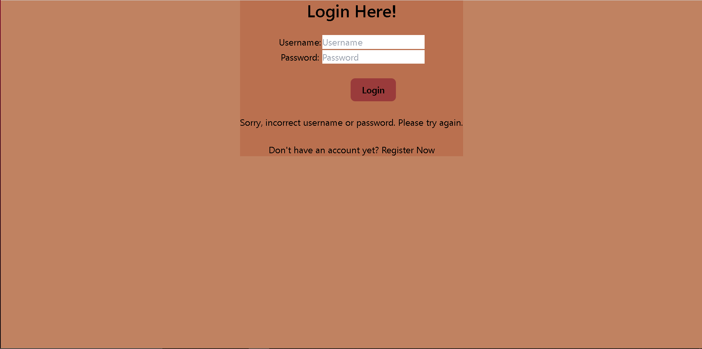
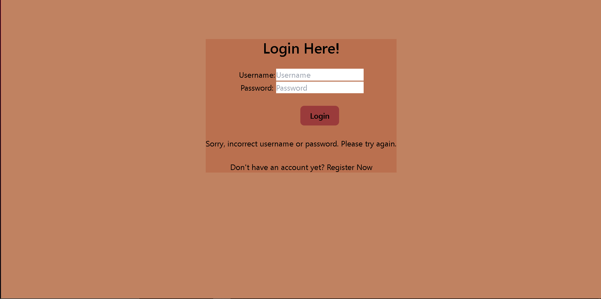
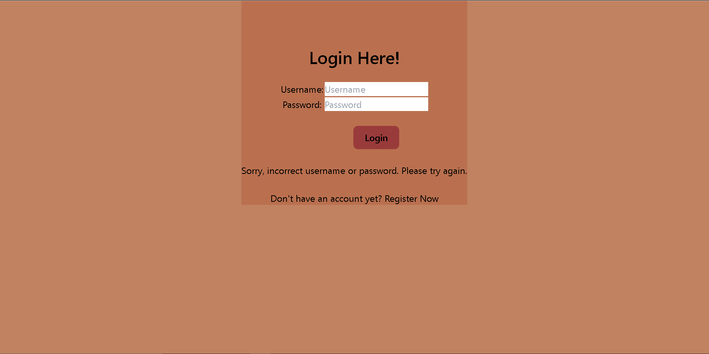

# Invenetory App Using Django

# Links
https://invenetory.adaptable.app/main

- [Tugas 2](#tugas-2)
- [Tugas 3](#tugas-3)
- [Tugas 4](#tugas-4)
- [Tugas 5](#tugas-5)

<br/>

---

# Tugas 2

---

## Membuat Projek Django 
<details>
<summary> Initialize Django Project </summary>

1. Membuat direktori baru dengan nama `invenetory`.
    ```sh
    mkdir inventory
    cd inventory
    ```
2. Membuat virtual environment baru.
    ```python
    python -m venv env
    ```
3. Aktivasi virtual environment.
    - Windows:
        ```sh
        env\Scripts\activate.bat atau env\Scripts\activate
        ```
    - Unix (Mac/Linux):
        ```sh
        source env/bin/activate
        ```
4. Dalam direktori yang sama membuat `requirements.txt` dan menambahkan beberapa dependencies.
    ```python
    django
    gunicorn
    whitenoise
    psycopg2-binary
    requests
    urllib3
    ```
5. Install dependencies dengan perintah berikut dan mengaktifkan virtual environment sebelumnya.
    ```sh
    pip install -r requirements.txt
    ```
6. Membuat projek Django baru dengan nama `invenetory`.
    ```django
    django-admin startproject invenetory .
    ```


</details>
<details>
<summary> Configure and Testing Django Project untuk mengecek apakah Django Project kita berjalan</summary>

1. Menambahkan `*` ke `ALLOWED_HOST` di `settings.py` untuk keperluan deployment.
    ```python
    ...
    ALLOWED_HOSTS = ["*"]
    ...

    ```
2. Menjalankan server untuk melihat apakah Django Project berjalan.
    - Windows:
    ```python
    python manage.py runserver
    ```
    - Unix:
    ```
    ./manage.py runserver
    ```
3. Buka `http://localhost:8000` jika terdapat animasi roket maka Django Project sudah berjalan.

</details>

---

## Membuat App Main
<details>

<summary>Initialize Environment</summary>

1. Menjalankan virtual environment.
    - Windows:
        ```sh
        env\Scripts\activate.bat or env\Scripts\activate
        ```
    - Unix (Mac/Linux):
        ```sh
        source env/bin/activate
        ```
</details>

<details>

<summary>Membuat Aplikasi main dan templates</summary>

1.  Membuat aplikasi main dengan perintah startapp

    ```python
    python manage.py startapp main
    ```
2. Menambahkan aplikasi main ke INSTALLED_APPS di settings.py invenetory agar app dapat muncul.

    ```python
    INSTALLED_APPS = [
    ...,
    'main',
    ...
    ]    
    ```
3. Membuat direktorui baru dengan nama `templates`. 
4. Membuat file baru dengan nama `main.html` di dalam direktori templates.
</details>
<details>

<summary> Membuat Routing URL Aplikasi dan Projek</summary>

1. Membuat file baru `urls.py` di dalam direktori main.
    ```python
    from django.urls import path #Definisi pola URL
    from main.views import show_main #Fungsi dari views.py untuk tampilan

    app_name = 'main'

    urlpatterns = [
        path('', show_main, name='show_main'),
    ]
    ```
2. Pada file `urls.py `di dalam `direktori invenetory` import fungsi `include` dari `django.urls`.
    ```python
    ...
    from django.urls import path, include 
    #Fungsi include untuk import rute URL dari aplikasi main ke dalam projek
    ...
    ```
3. Menambahkan rute URL untuk mengarahkan ke tampilan main di dalam variabel `urlpatterns`.
    ```python
    urlpatterns = [
    ...
    path('main/', include('main.urls')),
    ...
    ]
    ```
</details>

<details>
<summary>Membuat Model Aplikasi main dan migrasi</summary>

1. Membuat model pada direktori aplikasi main di `models.py`
    ```python
    from django.db import models

    class Item(models.Model):
    name = models.CharField(max_length=255)
    amount =  models.IntegerField()
    description = models.TextField()
    code = models.IntegerField()
    price = models.IntegerField()   
    ```
2. Melakukan migrasi agar Django dapat melacak perubahan model.
    ```python
    python manage.py makemigrations
    ```
    ```python
    python manage.py migrate
    ```
</details>

<details>
<summary>Membuat fungsi pada views.py</summary>

1. Menambahkan import pada file views.py di direktori main.
    ```python
    from django.shortcuts import render
    ```

2. Membuat fungsi show_main yang menerima request dan mengembalikan tampilan yang sesuai,
    ```python
    
    def show_main(request):
        context = {
            'name': 'Toshiba',
            'amount': '2',
            'description':'Flashdisk',
            'code':'2232',
            'price':'30000',
        } #Data yang akan dikirimkan ke tampilan

        return render(request, "main.html", context)

    ```
</details>

---

## Post Project To GitHub
<details>
<summary>gitignore ,init, add, commit, push</summary>

1. Menambahkan file `.gitignore`
    ```
    # Django
    *.log
    *.pot
    *.pyc
    __pycache__
    db.sqlite3
    media

    # Backup files
    *.bak 

    # If you are using PyCharm
    # User-specific stuff
    .idea/**/workspace.xml
    .idea/**/tasks.xml
    .idea/**/usage.statistics.xml
    .idea/**/dictionaries
    .idea/**/shelf

    # AWS User-specific
    .idea/**/aws.xml

    # Generated files
    .idea/**/contentModel.xml

    # Sensitive or high-churn files
    .idea/**/dataSources/
    .idea/**/dataSources.ids
    .idea/**/dataSources.local.xml
    .idea/**/sqlDataSources.xml
    .idea/**/dynamic.xml
    .idea/**/uiDesigner.xml
    .idea/**/dbnavigator.xml

    # Gradle
    .idea/**/gradle.xml
    .idea/**/libraries

    # File-based project format
    *.iws

    # IntelliJ
    out/

    # JIRA plugin
    atlassian-ide-plugin.xml

    # Python
    *.py[cod] 
    *$py.class 

    # Distribution / packaging 
    .Python build/ 
    develop-eggs/ 
    dist/ 
    downloads/ 
    eggs/ 
    .eggs/ 
    lib/ 
    lib64/ 
    parts/ 
    sdist/ 
    var/ 
    wheels/ 
    *.egg-info/ 
    .installed.cfg 
    *.egg 
    *.manifest 
    *.spec 

    # Installer logs 
    pip-log.txt 
    pip-delete-this-directory.txt 

    # Unit test / coverage reports 
    htmlcov/ 
    .tox/ 
    .coverage 
    .coverage.* 
    .cache 
    .pytest_cache/ 
    nosetests.xml 
    coverage.xml 
    *.cover 
    .hypothesis/ 

    # Jupyter Notebook 
    .ipynb_checkpoints 

    # pyenv 
    .python-version 

    # celery 
    celerybeat-schedule.* 

    # SageMath parsed files 
    *.sage.py 

    # Environments 
    .env 
    .venv 
    env/ 
    venv/ 
    ENV/ 
    env.bak/ 
    venv.bak/ 

    # mkdocs documentation 
    /site 

    # mypy 
    .mypy_cache/ 

    # Sublime Text
    *.tmlanguage.cache 
    *.tmPreferences.cache 
    *.stTheme.cache 
    *.sublime-workspace 
    *.sublime-project 

    # sftp configuration file 
    sftp-config.json 

    # Package control specific files Package 
    Control.last-run 
    Control.ca-list 
    Control.ca-bundle 
    Control.system-ca-bundle 
    GitHub.sublime-settings 

    # Visual Studio Code
    .vscode/* 
    !.vscode/settings.json 
    !.vscode/tasks.json 
    !.vscode/launch.json 
    !.vscode/extensions.json 
    .history
    ```
2. Melalukan `init`, `add`, `commit`, dan `push` ke github.
    ```sh
    git init
    git remote add origin https://github.com/venedictchen/invenetory.git
    git branch -M main
    git add .
    git commit -m "<message>"
    git push -u origin main

    ```
</details>

---

## Django Unit Testing

<details>
<summary>Membuat Unit Test</summary>

1. Membuat unit test pada berkas `tests.py` di direktori aplikasi main.
    ```python
    from django.test import TestCase, Client
    from .models import Item
    class mainTest(TestCase):
        def test_main_url_is_exist(self):
            response = Client().get('/main/')
            self.assertEqual(response.status_code, 200)

        def test_main_using_main_template(self):
            response = Client().get('/main/')
            self.assertTemplateUsed(response, 'main.html')
            
        def test_model_creation(self):
            item = Item.objects.create(name='Test Name',amount=0,description='Test Description',code=0,price=0)
            self.assertEqual(item.name, 'Test Name')
            self.assertEqual(item.amount, 0)
            self.assertEqual(item.description, 'Test Description')
            self.assertEqual(item.code, 0)
            self.assertEqual(item.price, 0)
    ```
2. Menjalankan Test
    ```python
    python manage.py test
    ```
3. Apabila Test berhasil akan keluar informasi sebagai berikut.
    ```sh
    Found 3 test(s).
    Creating test database for alias 'default'...
    System check identified no issues (0 silenced).
    ...
    ----------------------------------------------------------------------
    Ran 3 tests in 0.209s

    OK
    Destroying test database for alias 'default'...
    ```
</details>

---

## Deployment Adaptable

1. Membuka website Adaptable dan sign in with github.
2. Create new app dan Connect an Existing Repository.
3. Memilih invenetory dan branch main sebagai aplikasi yang mau di deploy.
4. Memilih python app template.
5. Memilih PostgeSQL untuk tipe database.
6. Memilih python version yang sesuai di sini `3.11`.
7. Mengisi start command sebagai berikut `python manage.py migrate && gunicorn shopping_list.wsgi`.
8. Memilih nama domain `invenetory`.
9. Centang bagian HTTP Listener Port.

---

## Relasi urls.py, views.py, models.py, html (MTV)


1. HTTP Request akan diterima url.py dan akan diproses untuk mencari pola url dan method yang sesuai dengan request.
2. Pada views.py akan dijalankan logika method yang dibutuhkan.
3. Data akan diminta ke models.py dan models.py akan memberikan data yang dibutuhkan.
4. Proses write juga bisa dilakukan ke models.py tidak hanya read.
5. Selanjutnya template (.html) akan memberikan bentuk html ke views.py
6. Terakhir views.py akan memberikan HTTP Response berupa html.

---

## Mengapa kita memerlukan virtual environment?

Kita membutuhkan virtual environment agar tidak terjadinya tabrakan depedensi antar projek. Tabrakan
atau konflik yang dimaksud adalah adanya faktor luar, seperti python version. Dengan adanya virtual environment, maka setiap projek akan terisolasi sendiri dan memiliki
dependensi masing-masing.

## Apa itu MVC, MVT, MVVM?

<details>
<summary>MVC</summary>

1. MVC (Model View Controller) adalah pola desain dalam membuat sebuah aplikasi dengan cara
memisahkan kode menjadi 3 bagian, yaitu Model, View, dan Controller.
    - Model:
        Model adalah bagian yang bertugas untuk mengelola data di database.
    - View:
        View yang bertugas untuk menampilkan response dari request yang diberikan.
    - Controller:
        Controller merupakan bagian yang menghubungkan antara model dan view.

</details>

<details>
<summary>MVT</summary>

1. MVT (Model View Template) adalah pola desain yang mirip dengan MVC. MVT berbeda dengan MVC pada bagian
controller. Peran controller diganti oleh template. Pada MVC, kita harus menulis semua kode kontrol tertentu. Sedangkan pada MVT bagian controller di handle oleh framework itu sendiri.
    - Model:
        Model adalah bagian yang bertugas untuk mengelola data di database.
    - View:
        View yang bertugas untuk menampilkan output dari data yang telah diproses.
    - Template:
        Sebuah file HTML yang merupakan struktur dari tampilan yang akan diberikan ke pengguna.
</details>

<details>
<summary>MVVM</summary>

1. MVVM (Model View ViewModel) adalah pola desain yang dikenalkan oleh Microsoft sebagai alternatif dari MVC.
MVVM berfokus untuk membedakan bagian logic dari program dan UI(User Interface) terpisah. Controller diganti
oleh ViewModel. ViewModel terdiri dari Model yang diubah menjadi View, dan berisi perintah dari view yang dapat memengaruhi model.
    - Model:
        Model adalah bagian yang bertugas untuk logika aplikasi dan mengelola data yang didapatkan dari
        ViewModel.
    - View:
        View yang bertugas untuk menentukan struktur, tata letak, teks, gambar dan element UI lainnya. View akan menginformasikan ViewModel apa yang dilakukan oleh pengguna.
    - ViewModel:
        ViewModel merupakan bagian yang menjadi perantara antara View dan Model.

</details>

---


<br/>

# Tugas 3

---

## Apa Perbedaan antara form POST dan form GET dalam Django?

Form POST dan GET memiliki perbedaan sebagai berikut:   

- Keamanan Form POST lebih baik dibandingkan Form GET karena data tidak terlihat pada url bar, sedangkan
Form GET data terlihat pada url bar dan dapat dengan mudah dilihat.

- Form GET memiliki batasan jumlah data yang dapat dikirimkan. Sedangkan, form POST dapat mengirim data dengan
jumlah yang besar karena data dikirimkan ke body.

- Form GET digunakan ketika kita tidak ingin mengubah data, seperti pencarian. Sedangkan Form POST dapat kita
gunakan untuk mengubah data yang ada.

---

## Apa perbedaan utama antara XML, JSON, dan HTML dalam konteks pengiriman data?

Perbedaan utama antara XML, JSON, dan HTML dalam pengiriman data adalah sebagai berikut:

- XML: 
    - XML (eXtensible Markup Language) menyimpan data dalam bentuk mirip sebuah tree yang memiliki satu root. 
    Bentuk dari XML mirip dengan HTML yang memiliki tag-tag. XML memiliki fleksibilitas lebih tinggi, tetapi
    lebih berat secara syntax. XML juga dapat menerima banyak tipe data, seperti images, charts, graph, dan masih banyak lagi.

- JSON: 
    - JSON (Javascript Object Notation) menyimpan data dalam bentuk dictionary objek yang memiliki key dan value. Data-data yang ada dipisah dengan koma. JSON juga lebih mudah dibaca karena strukturnya yang mirip
    dengan objek dalam Javascript.

- HTML: 
    - HTML berfungsi untuk menampilkan data-data yang ada dari JSON atau XML kepada client sehingga dapat dilihat pengguna.

---

## Mengapa JSON sering digunakan dalam pertukaran data antara aplikasi web modern?

- JSON lebih sering digunakan dalam pertukaran data antara aplikasi web modern karena JSON lebih mudah untuk dibaca dan lebih ringan sehingga lebih cepat. Format JSON juga lebih mudah diparse dan support untuk banyak
bahasa pemograman. Oleh karena itu, JSON lebih banyak digunakan dalam pertukaran data di aplikasi web modern.

---

## Implementasi Form, Views, Routing.

<details>
<summary>Membuat Form</summary>

1. Membuat base HTML template di root folder. Di sini saya menggunakan Tailwind CSS untuk styling
    ```html
    
    
    <!DOCTYPE html>
    <html lang="en">
        <head>
            <meta charset="UTF-8" />
            <meta
                name="viewport"
                content="width=device-width, initial-scale=1.0"
            />
            <script src="https://cdn.tailwindcss.com"></script>
            
            
        </head>

        <body>
            
            
        </body>
    </html>
    ```
2. Add ke `settings.py` agar `base.html` visible sebagai templates.
    ```python

    TEMPLATES = [
    {
        'BACKEND': 'django.template.backends.django.DjangoTemplates',
        'DIRS': [BASE_DIR/'templates'],
        'APP_DIRS': True,
        'OPTIONS': {
            'context_processors': [
                'django.template.context_processors.debug',
                'django.template.context_processors.request',
                'django.contrib.auth.context_processors.auth',
                'django.contrib.messages.context_processors.messages',
            ],
        },
    },
    ]
    ```

3. Membuat file `forms.py` pada direktori main untuk membuat ItemForm yang berisi model dan fields.
    ```python
    from django.forms import ModelForm
    from main.models import Item

    class ItemForm(ModelForm):
        class Meta:
            model = Item
            fields = ["name", "amount", "description","code","price"]
    ```

4. Membuat fungsi baru `create_item` di views.py yang menerima request, mengakses create_item.html, membuat form dengan ItemForm, validasi form, menyimpan form, dan redirect ke halaman main saat berhasil menyimpan data.
    ```python
    ...
    from django.shortcuts import render
    from django.http import HttpResponseRedirect
    from django.urls import reverse
    from django.http import HttpResponse
    from django.core import serializers

    def create_item(request):

    form = ItemForm(request.POST or None)

    if form.is_valid() and request.method == "POST":
        form.save()
        return HttpResponseRedirect(reverse('main:show_main'))

    context = {'form': form}
    return render(request, "create_item.html", context)
    ```
5. Menambahkan path ke `urls.py` agar `create_item` dapat diakses.
    ```python
    from main.views import show_main, create_item
    path('create-item', create_item, name='create_item'),
    ```
6. Mengubah fungsi `show_main` pada `views.py` dengan memberikan semua item ke dalam context items.
    ```python
    ...
    from main.models import Item
    def show_main(request):
        items = Item.objects.all()
        context = {
            'nama_mahasiswa': 'Venedict Chen',
            'kelas': 'D',
            'items':items,
        }

        return render(request, "main.html", context)
    ```


7. Mengisi `create_item.html` dengan form yang sudah dibuat.
    ```html
     
    
    
    <div class="flex flex-col items-center text-white t w-full bg-gray-600 h-screen ">
        
        <h5 class="text-3xl text-yellow-300 font-bold text-center mt-10 mb-14">Add New Item</h5>
        
        <div class="mr-20 text-black">
        <form method="POST">
        
        <table>
            {{ form.as_table }}
            <tr>
            <td></td>
            <td >
        <input class="text-black font-semibold mt-10 rounded-lg px-5 bg-white" type="submit" value="Add Item"/>
            </td>
            </tr>
        </table>
    </form>
    </div>
    </div>

    
    ```
8. Membuat `show_html.html` untuk menunjukkan data. Saya menambahkan back to main menu dan add item.
    ```html
     

    
    <div class="flex flex-col px-12 py-24 min-h-screen text-white bg-gray-600">
        <h2 class="text-3xl text-yellow-300 font-bold mb-8">Your Items,</h2>
    <table class="table-fixed w-full border-collapse border border-white">
        <thead>
            <tr>
                <th class="border border-white px-4 py-2">Name</th>
                <th class="border border-white px-4 py-2">Amount</th>
                <th class="border border-white px-4 py-2">Description</th>
                <th class="border border-white px-4 py-2">Price</th>
            </tr>
        </thead>
        <tbody>
            
                <tr>
                    <td class="border border-white px-4 py-2">{{item.code}} - {{ item.name }}</td>
                    <td class="border border-white px-4 py-2">{{ item.amount }}</td>
                    <td class="border border-white px-4 py-2">{{ item.description }}</td>
                    <td class="border border-white px-4 py-2">{{ item.price }}</td>
                </tr>
            
        </tbody>
    </table>

    <br />
    <div class="flex flex-row">
    <a href="">
        <button class="text-black font-semibold rounded-lg bg-white py-2 px-2 mx-6">
            Back to Main Menu
        </button>
    </a>
    <a href="">
        <button class="text-black rounded-lg font-semibold  bg-white py-2 px-2 mx-6">
            Add Items
        </button>
    </a>
    </div>
    </div>

    
    ```
</details>
<details>
<summary>Menambahkan Fungsi di views.py</summary>

1. Menambahkan import `HttpResponse` dan `Serializer`.
    ```python
    ...
    from django.http import HttpResponse
    from django.core import serializers
    ```
2. Membuat fungsi untuk `show_html`.
    ```python
    def show_html(request):
        items = Item.objects.all()
        context = {'items':items}
        return render(request,"show_html.html",context)
    ```
3. Membuat fungsi untuk `show_xml` dengan return HttpResponse yang kita serialize dan parameter `content_type="application/xml`.
    ```python
    def show_xml(request):
        data = Item.objects.all()
        return HttpResponse(serializers.serialize("xml",data),content_type = "application/xml")
    ```
4. Membuat fungsi untuk `show_json` dengan return HttpResponse yang kita serialize dan parameter `content_type="application/json`.
    ```python
    def show_json(request):
        data = Item.objects.all()
        return HttpResponse(serializers.serialize("json",data),content_type= "application/json")

    ```
5. Membuat fungsi untuk `show_xml_by_id` dengan return HttpResponse yang kita serialize dan parameter `content_type="application/xml`. Kita filter object berdasarkan id.
    ```python
    def show_xml_by_id(request,id):
        data = Item.objects.filter(pk=id)
        return HttpResponse(serializers.serialize("xml",data),content_type="application/xml")
    ```
6. Membuat fungsi untuk `show_json_by_id` dengan return HttpResponse yang kita serialize dan parameter `content_type="application/json`. Kita filter object berdasarkan id.
    ```python
    def show_json_by_id(request,id):
        data = Item.objects.filter(pk=id)
        return HttpResponse(serializers.serialize("json",data),content_type="application/json")
    ```
</details>

<details>
<summary>Menambahkan Routing di urls.py</summary>

1. Menambahkan import fungsi yang terlah dibuat pada `urls.py` di direktori main.
    ```python
    from main.views import show_main, create_item, show_xml, show_json, show_xml_by_id, show_json_by_id,show_html
    ```
2. Menambahkan path dengan fungsi yang sudah dibuat sebelumnya. Menambahkan juga `<int:id>` untuk akses by_id.
    ```python
    urlpatterns = [
        path('', show_main, name='show_main'),
        path('create-item', create_item, name='create_item'),
        path('xml/',show_xml,name='show_xml'),
        path('html/',show_html,name='show_html'),
        path('json/',show_json,name='show_json'),
        path('xml/<int:id>/',show_xml_by_id,name='show_xml_by_id'),
        path('json/<int:id>/',show_json_by_id,name='show_json_by_id')
    ]
    ```
</details>

## Screenshot Postman

1. HTML
    - 
    - 
    - 
    - 
    - 

2. XML
    - 
    - 

3. JSON
    - 
    - 
    - 

4. XML by ID
    - 
5. JSON by ID
    - 

---

<br/>

# Tugas 4

## Apa itu Django UserCreationForm, dan jelaskan apa kelebihan dan kekurangannya?

- Django UserCreationForm adalah built-in user authentication system dari Django. Django menyediakan form registrasi pengguna. Formulir ini memungkinkan pengguna untuk mengisi data seperti username dan password saat mereka mendaftar.

- Kelebihan:
    - Mudah digunakan karena built-in dari Django sendiri. Kita hanya perlu melakukan import dan menggunakannya tanpa rumit.
    - Terintegrasi dengan baik dengan Django
    - Validasi Otomatis

- Kekurangan:
    - Ketergantungan pada template bawaan sehingga tampilan menyesuaikan yang sudah ada dan jika ingin berbeda harus melakukan kustomisasi yang cukup ribet.
    - Tidak dapat digunakan untuk form yang memiliki kasus khusus dan spesifik sehingga kita terbatas dengan template yang ada.

---

## Apa perbedaan antara autentikasi dan otorisasi dalam konteks Django, dan mengapa keduanya penting?

- Autentikasi adalah proses memverifikasi siapa yang login. Sedangkan, otorisasi adalah proses memverifikasi apakah seseorang berhak untuk mengakses sesuatu.

- Keduanya penting untuk keamanan website kita karena kita tidak ingin orang yang tidak berwewenang untuk mengakses website kita dan membobol data yang ada. Dengan otorisasi kita dapat memastikan pengguna hanya dapat melalukan tindakan sesuai peran atau izin yang diberikan.

---

## Apa itu cookies dalam konteks aplikasi web, dan bagaimana Django menggunakan cookies untuk mengelola data sesi pengguna?

- Cookies adalah data kecil untuk informasi yang dikirim oleh web server ke browser dan mengirimkan kembali dari browser untuk kebutuhan page kedepannya. Cookies digunakan untuk autentikasi, pelacakan pengguna, dan mempertahankan preferensi pengguna.

- Pada Django cookie digunakan untuk menyimpan informasi autentikasi, seperti sesi atau token yang memungkinkan pengguna untuk tetap masuk saat mengakses web.

- Django memiliki mekanisme bawaan untuk mengelola sesi pengguna. Dengan begitu data sesi pengguna akan tersimpan dalam cookies. Django dapat dikonfigurasi untuk menyimpan data sesi pengguna dalam cookies sehingga data dapat diakses oleh server setiap permintaan berikutnya Data sesi ini dapat digunakan untuk menyimpan informasi yang berhubungan dengan pengguna saat mengakses web. 

---

## Apakah penggunaan cookies aman secara default dalam pengembangan web, atau apakah ada risiko potensial yang harus diwaspadai?

- Pada umumnya penggunaan cookies aman untuk website. Akan tetapi, ada beberapa risiko yang harus diwaspadai. Cookies dapat menjadi target potensial penyerang website dengan memanfaatkan cookies yang dimiliki pengguna dan menjalankan tindakan pada sesi tersebut tanpa sepengetahuan pengguna. 

- Bentuk serangan yang dapat terjadi, seperti Cross-site Scripting (XSS) dan Cross-site Request Forgery merupakan contoh pemanfaatan cookies yang tidak dijaga dengan baik untuk penyerangan website.

---

## Implementasi fungsi registrasi, login, dan logout.

<details>
<summary>Fungsi Register dan Form Register</summary>

1. Membuat fungsi register di `views.py` dan menambahkan beberapa import yang dibutuhkan
    ```python
    from django.shortcuts import redirect
    from django.contrib.auth.forms import UserCreationForm
    from django.contrib import messages  

    def register(request):
        form = UserCreationForm()

        if request.method == "POST":
            form = UserCreationForm(request.POST)
            if form.is_valid():
                form.save()
                messages.success(request, 'Your account has been successfully created!')
                return redirect('main:login')
        context = {'form':form}
        return render(request, 'register.html', context)

    ```
2. Membuat file HTML baru `register.html` di folder `main/templates`

    ```HTML
    

    
        <title>Register</title>
    

      

    <div class = "login bg-[#C08261] min-h-screen flex flex-col items-center">
        <div class="flex flex-col items-center gap-6 text-center bg-[#BA704F] px-32 py-10 my-24">
            <h1 class="text-3xl font-semibold">Register</h1>
        

            <form method="POST" >  
                  
                <table>  
                    {{ form.as_table }}  
                    <tr>  
                        <td></td>
                        <td><input type="submit" class="text-black font-semibold mt-6 rounded-lg px-5 py-2 bg-[#9A3B3B]" 
                            name="submit" value="Daftar"/></td>  
                    </tr>  
                </table>  
            </form>

          
            <ul>   
                  
                    <li>{{ message }}</li>  
                      
            </ul>   
        
        </div>
    </div>  

    
    ```

3. Menambahkan path `register/` di `urls.py`

    ```python
    from main.views import register
    urlpatterns = [
    ...
    path('register/',register,name='register'),
    ]
    ```
</details>
<details>
<summary>Fungsi Login dan Form Login</summary>

1. Menambahkan import dan membuat fungsi `login_user`

```python
    from django.contrib.auth import authenticate, login
    def login_user(request):
        if request.method == 'POST':
            username = request.POST.get('username')
            password = request.POST.get('password')
            user = authenticate(request, username=username, password=password)
            if user is not None:
                login(request, user)
                return redirect('main:show_main')
            else:
                messages.info(request, 'Sorry, incorrect username or password. Please try again.')
        context = {}
        return render(request, 'login.html', context)
```

2. Membuat file HTML baru `login.html` di folder `main/templates`
```HTML



    <title>Login</title>



<div class="login bg-[#C08261] min-h-screen flex flex-col items-center">

    <div class="flex flex-col text-center items-center   mr-8 gap-6 text-center bg-[#BA704F] px-32 py-10 my-32">
        <h1 class="text-3xl font-semibold">Login Here!</h1>

        <form method="POST" action="">
            
            <table>
                <tr>
                    <td>Username: </td>
                    <td><input type="text" name="username" placeholder="Username" class="form-control"></td>
                </tr>

                <tr>    
                    <td>Password: </td>
                    <td><input type="password" name="password" placeholder="Password" class="form-control"></td>
                </tr>

                <tr>
                    <td></td>
                    
                    <td >
                        <input class="text-black font-semibold mt-6 rounded-lg px-5 py-2 bg-[#9A3B3B]" 
                        type="submit" value="Login"/>
                    </td>
                </tr>
            </table>
        </form>

        
            <ul>
                
                    <li>{{ message }}</li>
                
            </ul>
        

        <p>Don't have an account yet? <a href="">Register Now</a></p>
    </div>
</div>


```
3. Menambahkan path `login/` di `urls.py`

    ```python
    from main.views import login_user
    urlpatterns = [
    ...
    path('login/', login_user, name='login'),
    ]
    ```
4. Retriksi login required untuk retriksi halaman main dengan menambahkan login required di atas fungsi `show_main`

```python
from django.contrib.auth.decorators import login_required
...
@login_required(login_url='/login')
def show_main(request):
...

```

</details>

<details>
<summary>Membuat Fungsi Logout dan Tombol Logout</summary>

1. Menambahkan import dan Membuat Fungsi logout di `views.py`

    ```python
    from django.contrib.auth import logout  
    def logout_user(request):
        logout(request)
        return redirect('main:login')
    ```

2. Menambahkan tombol logout dan link ke `main:logout`
    ```HTML
    <a href="">
        <button class="text-black font-semibold rounded-lg bg-[#9A3B3B] py-2 px-2 mx-6
        hover:bg-[#D13535]">
        Logout
        </button>
    </a>
                
    ```

3. Menambahkan path `logout/` di `urls.py`
    ```python
    from main.views import logout_user
    urlpatterns = [
    ...
    path('logout/', login_user, name='logout'),
    ]
    ```
</details>

---

## Menghubungkan Model Item dengan User

1. Mengimport User dan menambahkan Foreign Key, null, dan blank pada `models.py` 
```python
user = models.ForeignKey(User, on_delete=models.CASCADE,null=True,blank=True)
```

2. Mengganti fungsi `create_item` pada `views.py` sehingga terhubung dengan item per user dan `commit=false` agar Django tidak langsung save

```python
def create_item(request):
    form = ItemForm(request.POST or None)

    if form.is_valid() and request.method == "POST":
        item = form.save(commit=False)
        item.user = request.user
        item.save()
        return HttpResponseRedirect(reverse('main:show_main'))
    
    context = {'form': form}
    return render(request, "create_item.html", context)
```

3. Menambahkan filter berdasarkan user di fungsi `show_main` pada `views.py`

```python
def show_main(request):
    items = Item.objects.filter(user=request.user)
    context = {
        'nama_mahasiswa': request.user.username.capitalize(),
        ...
    }
    ...
```

---
## Menampilkan Detail Informasi Pengguna Yang Sedang Logged In 

1. Import datetime dan mengganti fungsi `login_user` pada bagian `if user is not none` dengan response dan `set_cookie`

```python
import datetime
...
if user is not None:
    login(request, user)
    response = HttpResponseRedirect(reverse("main:show_main")) 
    response.set_cookie('last_login', str(datetime.datetime.now()))
    return response
...
```
2. Menambahkan `last_login` pada fungsi `show_main` dengan `request.COOKIES`

```python
def show_main(request):
    items = Item.objects.filter(user=request.user)
    context = {
        'nama_mahasiswa': request.user.username.capitalize(),
        'kelas': 'D',
        'items':items,
        'last_login':request.COOKIES['last_login'],
    }

    return render(request, "main.html", context)
```

3. Menambahkan delete cookie saat logout

```python
def logout_user(request):
    logout(request)
    response = HttpResponseRedirect(reverse('main:login'))
    response.delete_cookie('last_login')
    return response
```

4. Menampilkan di `main.html` pada folder `main/templates`

```HTML
...
 <h1 class="text-xl text-[#493323] font-semibold">Last login: {{last_login}}</h1>
...
```
---

# Tugas 5

## Jelaskan manfaat dari setiap element selector dan kapan waktu yang tepat untuk menggunakannya.
 
1. Element Selector digunakan saat kita ingin mengubah semua properti tag HTML yang sama

```HTML
<body>
  <div>
    <h1>Testing</h1>
    <h2>Haii</h2>
  </div>
  ...
</body>
```
- Kita dapat menggunakan element selector untuk styling dengan contoh berikut
```CSS
h1 {
  color: red;
}
```

2. ID Selector digunakan saat kita ingin menggunakan ID pada tag sebagai selector. ID bersifat unik.

```HTML
<body>
  <div id="header">
    <h1>Testing</h1>
  </div>
  ...
</body>
```

```CSS
#header {
  text-align: center;
  color: red;
}
```

3. Class Selector digunakan untuk mengelompokkan elemen dengan karakteristik yang sama dalam sebuah class.

```HTML
<body>

<h1 class="center">Testing</h1>
<p class="center">Haiii</p> 

</body>
```

```CSS
.center {
  text-align: center;
  color: red;
}
```

--- 

## Jelaskan HTML5 Tag yang kamu ketahui.

1. Tag `<a>` untuk hyperlink ke link yang dituju.

2. Tag `<div>` untuk membuat container atau sebuah section.

3. Tag `<head>` yang berfungsi untuk spesifikasi dokumen.

4. Tag `<h1>-<h6>` yang berfungsi untuk header dari ukuran paling besar ke paling kecil.

5. Tag `` untuk memasukkan gambar.

6. Tag `<li>` untuk membuat suatu list

7. Tag `<meta>` untuk informasi yang dibutuhkan

8. Tag `<p>` untuk paragraf

9. Tag `<script>` untuk memasukkan script

10. Tag `<table>` untuk table diikuti 

11. Tag `<thead> <tr> <td>` tag thead untuk header table, tag tr untuk baris table dan td untuk cell table.

12. Tag `<video>` untuk video

---

## Jelaskan perbedaan antara margin dan padding.

1. Margin adalah penataan dari luar, sedangkan padding adalah penataan dari dalam.

2. Contoh visualisasi:
    - Sebelum margin dan padding 
    

    - Setelah margin
    

    - Setelah padding 
    

---

##  Jelaskan perbedaan antara framework CSS Tailwind dan Bootstrap. Kapan sebaiknya kita menggunakan Bootstrap daripada Tailwind, dan sebaliknya?

1. Tailwind CSS menggabungkan kelas-kelas yang sudah didefinisikan sebelumnya. Sedangkan bootstrap menggukan styling dan komponen yang telah didefinisikan. Bootstrap juga memiliki tampilan yang sudah jadi dan dapat digunakan langsung.

2. Tailwind lebih fleksibel dan adaptif terhadap proyek. Sedangkan, Bootstrap lebih konsisten dalam setiap proyek karena sudah didefinisikan sebelumnya.

3. File CSS Tailwind lebih kecil dibandingkan dengan Bootstrap.

4. Keduanya memiliki fungsionalitas masing-masing. Saat anda ingin membuat website dengan tata letak yang umum dan praktis dapat menggunakan Bootstrap. Namun, saat ingin membuat website dengan tata letak yang fleksibel, maka dapat menggunakan Tailwind.

---

## Jelaskan bagaimana cara kamu mengimplementasikan checklist di atas secara step-by-step.

<details>
<summary>Memasukkan script CDN Tailwind dan link Font Awesome</summary>

1. Pada `base.html` di bagian `<head>` tambahkan
    ```HTML
    ...
      <script src="https://cdn.tailwindcss.com"></script>
      <link href="https://cdnjs.cloudflare.com/ajax/libs/font-awesome/5.15.1/css/all.min.css" rel="stylesheet">

    ...
    ```

    
</details>

<details>
<summary>Menambahkan Styling halaman Login, Register, Add Item, Show Item, dan main</summary>

1. Pada halaman login dengan styling tengah dan memberikan warna serta bentuk yang lebih enak dilihat. Desain memanfaatkan flex
```HTML



    <title>Login</title>



<div class="login bg-[#C08261] min-h-screen flex flex-col items-center">

    <div class="flex flex-col text-center items-center gap-6 text-center bg-[#BA704F] px-32 py-10 my-32 mr-4">
        <h1 class="text-3xl font-semibold">Login Here!</h1>

        <form method="POST" action="">
            
            <table>
                <tr>
                    <td>Username: </td>
                    <td><input type="text" name="username" placeholder="Username" class="form-control"></td>
                </tr>

                <tr>    
                    <td>Password: </td>
                    <td><input type="password" name="password" placeholder="Password" class="form-control"></td>
                </tr>

                <tr>
                    <td></td>
                    
                    <td >
                        <input class="text-black font-semibold mt-6 rounded-lg px-5 py-2 bg-[#9A3B3B]" 
                        type="submit" value="Login"/>
                    </td>
                </tr>
            </table>
        </form>

        
            <ul>
                
                    <li>{{ message }}</li>
                
            </ul>
        

        <p>Don't have an account yet? <a href="">Register Now</a></p>
    </div>
</div>


```

2. Pada halaman register yang hampir sama dengan login. Desain dengan memanfaatkan flex.
```HTML



    <title>Register</title>


  

<div class = "login bg-[#C08261] min-h-screen flex flex-col items-center">
    <div class="flex flex-col items-center gap-6 text-center bg-[#BA704F] px-32 py-10 my-24">
        <h1 class="text-3xl font-semibold">Register</h1>
     

        <form method="POST" >  
              
            <table>  
                {{ form.as_table }}  
                <tr>  
                    <td></td>
                    <td><input type="submit" class="text-black font-semibold mt-6 rounded-lg px-5 py-2 bg-[#9A3B3B]" 
                        name="submit" value="Daftar"/></td>  
                </tr>  
            </table>  
        </form>

      
        <ul>   
              
                <li>{{ message }}</li>  
                  
        </ul>   
    
    </div>
</div>  


```

3. Pada halaman Add Item styling tombol dengan tambahan tombol back dan pewarnaan sesuai tema. Menambahkan styling on hover pada button. Desain dengan memanfaatkan flex.

```HTML
 
<div
  class="flex flex-col items-center text-white t w-full bg-[#C08261] min-h-screen"
>
  <h5 class="text-3xl text-[#630000] font-bold text-center mt-10 mb-14">
    Add New Item
  </h5>

  <div class="mr-20 text-black mb-16">
    <a href="">
      <button
        class="text-black font-semibold rounded-lg bg-[#9A3B3B] px-2 mb-4 hover:bg-[#D3D3D3]"
      >
        Back to Main Menu
      </button>
    </a>
    <form method="POST">
      
      <table>
        {{ form.as_table }}
        <tr>
          <td></td>
          <td>
            <input
              class="cursor-pointer text-black font-semibold mt-10 rounded-lg px-5 py-2 bg-[#9A3B3B]
               hover:bg-[#D3D3D3]" type="submit" value="Add Item"
            />
          </td>
        </tr>
      </table>
    </form>
  </div>
</div>



```

4. Pada halaman show item mengganti tabel dengan bentuk card yang lebih menarik dan menambahkan button back to main menu dan add items untuk ke halaman Add Item. Menambahkan juga icon untuk delete, increase, dan decrease dari font awesome yang sudah dimasukkan sebelumnya. Desain dengan memanfaatkan flex.

```HTML



<div class="flex flex-col pl-12  py-12 min-h-screen text-black bg-[#C08261]">
  <h2 class="text-3xl text-[#630000] font-bold mb-8">Your Items</h2>

  <div class="flex flex-wrap mb-2 items-center mx-12">

    
    <div
      class="flex flex-col bg-[#FAF2D3]  shadow-lg rounded-lg mx-2 my-4 p-4 last:bg-yellow-300 hover:bg-[#D3D3D3] transition-all duration-300">


      <p class="text-xl font-semibold">{{item.name}}</p>
      <p>{{item.code}} - {{item.description}}</p>
      <p>Price: {{item.price}}</p>
      <p>Stock: {{item.amount}}</p>
      <div class="flex flex-row mt-2 gap-4">
        <a href="">
          <i class="fas fa-trash-alt text-red-500  cursor-pointer hover:text-red-700"></i>
        </a>

        <a href="">
          <i class="fas fa-plus-circle text-green-500  cursor-pointer hover:text-green-700"></i>
        </a>

        <a href="">
          <i class="fas fa-minus-circle text-blue-500  cursor-pointer hover:text-blue-700"></i>
        </a>

      </div>
    </div>

    


  </div>

  <div class="flex flex-row mx-12 my-4">
    <a href="">
      <button class="text-black font-semibold rounded-lg bg-[#9A3B3B] py-2 px-4 mx-2 hover:bg-[#D3D3D3]">
        Back to Main Menu
      </button>
    </a>
    <a href="">
      <button class="text-black font-semibold rounded-lg bg-[#9A3B3B] py-2 px-4 mx-2 hover:bg-[#D3D3D3]">
        Add Items
      </button>
    </a>
  </div>
</div>
</div>

```

5. Pada bagian bonus memanfaatkan `last:` yang merupakan pseudo class modifiers sehingga item terakhir memiliki backgorund yang berbeda sendiri.

```HTML
...
<div class="flex flex-col bg-[#FAF2D3]  shadow-lg rounded-lg mx-2 my-4 p-4 last:bg-yellow-300 hover:bg-[#D3D3D3] transition-all duration-300">
...

```
</details>

---

# Tugas 6 
## Jelaskan perbedaan antara asynchronous programming dengan synchronous programming.
- Asynchronous programming adalah proses berjalannya program tanpa terikat dengan proses lain. Sedangkan, synchronous programming adalah jalannya program secara sequential atau berdasarkan urutan eksekusi program. Asynchronous berjalan dengan multi thread dan synchronous berjaalan dengan single thread.

## Dalam penerapan JavaScript dan AJAX, terdapat penerapan paradigma event-driven programming. Jelaskan maksud dari paradigma tersebut dan sebutkan salah satu contoh penerapannya pada tugas ini.
- Event-driven programming adalah pendekatan pemograman yang cara kerjanya merespons terjadinya suatu peristiwa, yaitu interaksi dari pengguna. Program akan memiliki event yang sudah didefinisikan sebelumnya. Saat pengguna melalukan event tersebut, maka event itu akan dihandle. Contoh penggunaanya pada tugas ini adalah sebagai berikut 

```HTML
document.getElementById("button_add").onclick = addItems
```

## Jelaskan penerapan asynchronous programming pada AJAX.
-  Pada AJAX penerapan asynchronous dilakukan dengan cara ketika event terjadi pada halaman web, maka sebuah XMLHttpRequest object akan dibuah oleh JavaScript dan dikirimkan ke server. Server akan memproses request dan membuat response dan mengembalikan data kembali ke browser. Response akan dibaca oleh JavaScript. Dengan penggunaan event listener, proses ini dapat berjalan dengan asynchronous tanpa menganggu penggunaan halaman web oleh pengguna.

## Pada PBP kali ini, penerapan AJAX dilakukan dengan menggunakan Fetch API daripada library jQuery. Bandingkanlah kedua teknologi tersebut dan tuliskan pendapat kamu teknologi manakah yang lebih baik untuk digunakan.
- Fetch API merupakan teknologi yang lebih baru dibandingkan dengan library jQUERY. Fetch API juga lebih ringan dibandingkan library jQuery. Fetch API menggukan promises, yaitu memudahkan penanganan asinkron dan menghindari callback hell(nested callback). Ini membuat kode lebih mudah dibaca dan dipelihara. Menurut saya, Fetch API lebih baik digunakan karena lebih ringan dan modern. Fetch API juga lebih mudah dibaca dan dipelihara karena terstruktur. Dengan Fetch API handling asinkron lebih mudah.

## Jelaskan bagaimana cara kamu mengimplementasikan checklist di atas secara step-by-step.


<details>   
<summary>AJAX GET</summary>

1. Step awal saya menambahkan button `Add Item by AJAX` dan modal
```HTML
      <div class="modal fade" id="exampleModal" tabindex="-1" aria-labelledby="exampleModalLabel" aria-hidden="true">
      <div class="modal-dialog">
        <div class="modal-content">
          <div class="modal-header bg-[#630000] text-white">
            <h1 class="modal-title fs-5" id="exampleModalLabel">Add New Item</h1>
            <button type="button" class="btn-close text-white" data-bs-dismiss="modal" aria-label="Close"></button>
          </div>
          <div class="modal-body">
            <form id="form" onsubmit="return false;">
              
              <div class="mb-3">
                <label for="name" class="col-form-label">Name:</label>
                <input type="text" class="form-control" id="name" name="name" placeholder="Enter the item name">
              </div>
              <div class="mb-3">
                <label for="price" class="col-form-label">Amount:</label>
                <input type="number" class="form-control" id="amount" name="amount" placeholder="Enter the item amount">
              </div>
              <div class="mb-3">
                <label for="description" class="col-form-label">Description:</label>
                <textarea class="form-control" id="description" name="description"
                  placeholder="Enter the item description"></textarea>
              </div>
              <div class="mb-3">
                <label for="description" class="col-form-label">Code:</label>
                <textarea class="form-control" id="code" name="code" placeholder="Enter the item code"></textarea>
              </div>
              <div class="mb-3">
                <label for="description" class="col-form-label">Price:</label>
                <textarea class="form-control" id="price" name="price" placeholder="Enter the item price"></textarea>
              </div>
            </form>
          </div>
          <div class="modal-footer">
            <button type="button" class="rounded-lg text-white bg-[#630000] px-4 py-2 mx-2"
              data-bs-dismiss="modal">Close</button>
            <button type="button" id="button_add" class="rounded-lg text-white bg-[#630000] px-4 py-2 mx-2"
            data-bs-dismiss="modal">Add Item</button>
          </div>
        </div>
      </div>
    </div>

    <button type="button" class="text-black font-semibold rounded-lg bg-[#9A3B3B] py-2 px-4 mx-2 hover:bg-[#D3D3D3]"
      data-bs-toggle="modal" data-bs-target="#exampleModal">Add Item by AJAX</button>
  </div>
  ```
2. Lalu, saya menambahkan script `bootstrap` di base.html

3. Selanjutnya saya membuat fungsi `getItems` dan `refreshItems` yang berguna untuk fetch data dari show_json dan refresh items yang ada.

```HTML
    async function getItems() {
        return fetch("").then((res) => res.json())
    }


    async function refreshItems() {
        document.getElementById("card_item").innerHTML = ""
        const items = await getItems()
        let htmlString = ""
        items.forEach((item) => {
        htmlString += `\n <div class="flex flex-col bg-[#FAF2D3] shadow-lg rounded-lg mx-4 my-4 p-4 last:bg-yellow-300 hover:bg-[#D3D3D3] transition-all duration-300 w-[280px] h-[180px]
        break-words">

                <p class="text-xl font-semibold">${item.fields.name}</p>
                <p>${item.fields.code} - ${item.fields.description}</p>
                <p>Price: ${item.fields.price}</p>
                <p>Stock: ${item.fields.amount}</p>
                <div class="flex flex-row mt-2 gap-4">
                    <a onClick="deleteItem(${item.pk});">
                    <i class="fas fa-trash-alt text-red-500  cursor-pointer hover:text-red-700"></i>
                </a>
            
                    <a href="/increase_item_amount/${item.pk}/">
                    <i class="fas fa-plus-circle text-green-500  cursor-pointer hover:text-green-700"></i>
                    </a>
            
                    <a href="/decrease_item_amount/${item.pk}/">
                    <i class="fas fa-minus-circle text-blue-500  cursor-pointer hover:text-blue-700"></i>
                    </a>
            
                </div>
                </div>
                
                </div>`
        })

        document.getElementById("card_item").innerHTML = htmlString
    }

    refreshItems()
```

</details>
<details>
<summary>AJAX POST </summary>


1. Saya membuat fungsi `add_item_ajax` di `views.py` untuk add item dengan AJAX. Saya juga menggunakan dekorator `csrf_exempt`

```python
@csrf_exempt
def add_item_ajax(request):
    if request.method == 'POST':
        user = request.user
        name = request.POST.get("name")
        amount = request.POST.get("amount")
        description = request.POST.get("description")
        code  = request.POST.get("code")
        price = request.POST.get("price")

        new_item = Item(user=user,name=name,amount=amount,code=code, description=description, price=price)
        new_item.save()

        return HttpResponse(b"CREATED", status=201)

    return HttpResponseNotFound()
```
2. Saya juga menambahkan path ke `urls.py`
```python
    ...
    path('add-item-ajax/', add_item_ajax, name='add_item_ajax')
    ...

```
3. Langkah awal saya awali dengan membuat fungsi addItem di `script` pada `show_html.html`

```HTML

function addItems() {
    fetch("", {
      method: "POST",
      body: new FormData(document.querySelector('#form'))
    }).then(refreshItems)

    document.getElementById("form").reset()
    return false
  }
  document.getElementById("button_add").onclick = addItems

```
Saya menambahkan eventlistener onclick sehingga saat pengguna klik add Item maka akan dijalankan fungsi addItems yang akan fetch `add_item_ajax` dan melakukan `refreshItems`

4. Lalu, saya menambahkan id `button_add` ke tombol Add Item di dalam Modal
```HTML
  <button type="button" id="button_add" class="rounded-lg text-white bg-[#630000] px-4 py-2 mx-2"
    data-bs-dismiss="modal">Add Item</button>
```
</details>